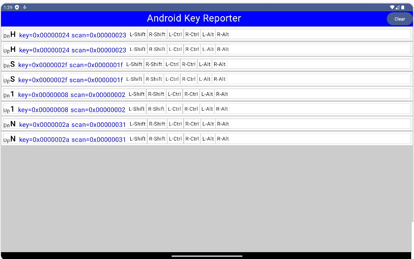

# Android-Keys

An Android program to show keyboard events.

Shows a list of down and up for each key, the character assigned to the key, key-code, scan-code, and some of the modifier keys; shift, alt, ctrl found on many keyboards.

**NOTE**: This program was developed to investigate the control panel of a [Rigol DHO800/900 series oscilliscope](https://www.rigolna.com/products/rigol-digital-oscilloscopes/dho800/). With that in mind, it includes classes (in the `com.rigol` package) that load and interact with a native shared library that can control more of the scope. The native library is _not included in this repository_ nor is that function enabled by default. If you want to enable this functionality you can extract the native library from your scope and put it in `app/src/main/jniLibs/arm64-v8a/libscope-auklet.so` and uncomment lines in the source code. The program is fully functional as a key reporter on any Android device without this library.
